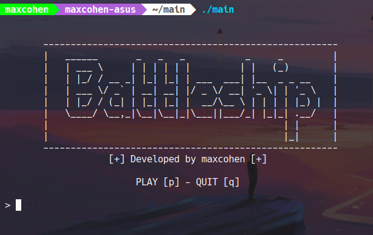

# Battleship
Command line battleship game written in C++

## Code walkthrough

#### print_board()
This function takes in a board, which is made by using an array structure, and print it to console.

#### place_ship()
This function accept three parameters: the board, the ship size and the ship symbol.
These three parameters are constituted respectively by an array, an integer and a char type.
The current user is prompted to locate the fleet by choosing a row, a column and the direction
of the ship he/she's placing. Rows and columns are integers if not entered correctly the user
is prompted to enter them the right way. The function takes care of the position of the fleet as well.

#### strike()
The strike function runs the logic of the attack. It takes in the opponent's board and then
prompt the user to enter two coordinates, X for row and Y for column. If hit, replace the 
X, Y coordinates with 'X' otherwise with 'O'.

#### welcome_menu()
A simple banner displayed in the terminal. 

#### play_quit()
Ask the user to play the game or to quit it.

## Future implementation
- Player Vs AI